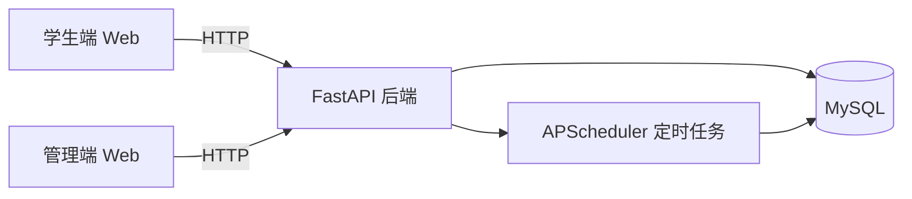
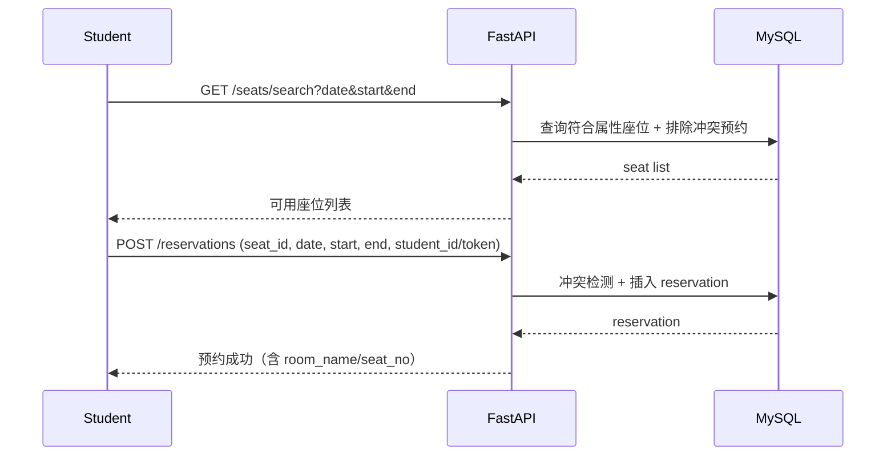

# 自习座位预约系统：用户故事重述、任务计划、风险与架构验证

> 依据：`Reservation/requirements/26春软件过程管理lab.md`  
> 目标：将需求重组为用户故事（User Story），并给出任务划分与计划、风险识别、以及架构选择与初步验证。  
> 团队划分（5人）：后端基础 ×1、后端 API（router）×1、测试 ×1、前端（学生端）×1、前端（管理端）×1。

---

## 1. 对需求的理解（用户故事化重述）

### 1.1 角色与核心概念
- **学生**：浏览自习室/座位、搜索、预约、签到、查看历史与违约。
- **管理员**：维护自习室与座位、查看预约与违约、按角色执行不同权限操作（RBAC）。
- **自习室（Room）**：可全校通用或院系专属；配置开放/关闭时间；每天有动态签到码/二维码。
- **座位（Seat）**：隶属自习室；有编号与属性（插座/靠窗/可用性）。
- **预约（Reservation）**：按整点小时，单次最长 4 小时（参数可调）；有签到与违约规则。

### 1.2 用户故事列表（按 Epic 分组）

> 说明：每条用户故事包含「作为…我想…以便…」与验收标准（AC）。  
> 编号示例：US-xxx；可直接用于 DevCloud 需求规划/测试用例关联。

#### Epic A：账号与登录

- **US-001 学生注册**
  - **故事**：作为学生，我想用学号+密码注册账号，以便使用预约系统。
  - **AC**：
    - 必填：学号、密码、姓名；可选：院系、邮箱
    - 学号唯一；重复注册给出明确错误

- **US-002 学生登录**
  - **故事**：作为学生，我想登录系统，以便查看对我开放的自习室并进行预约。
  - **AC**：
    - 正确凭证返回登录态（token 或等价身份信息）
    - 错误密码/学号返回 401

- **US-003 学生退出登录**
  - **故事**：作为学生，我想退出登录，以便保护账号安全。
  - **AC**：退出后不可继续以登录态访问受限功能

#### Epic B：自习室与座位浏览（含院系可见性）

- **US-004 查看可用自习室列表**
  - **故事**：作为学生，我想查看可用自习室列表，以便选择自习地点。
  - **AC**：
    - 返回已上线可用自习室（is_active=1）
    - 展示开放/关闭时间、所属院系（如有）

- **US-005 院系可见性过滤**
  - **故事**：作为学生，我只想看到对我开放的自习室，以免误预约不可用地点。
  - **AC**：
    - 全校通用（department=NULL）对所有学生可见
    - 院系专属（department=某院系）仅该院系学生可见

- **US-006 查看自习室座位列表与属性**
  - **故事**：作为学生，我想查看某自习室内的座位及插座/靠窗标记，以便挑选偏好座位。
  - **AC**：
    - 返回座位编号、是否可用、插座/靠窗标记

#### Epic C：搜索与预约

- **US-007 按时间段搜索可用座位**
  - **故事**：作为学生，我想按日期+起止时间搜索可用座位，以便快速找到空座。
  - **AC**：
    - 输入日期与起止时间（整点小时）
    - 返回在该时间段无有效预约冲突的座位

- **US-008 按插座/靠窗筛选**
  - **故事**：作为学生，我想筛选有插座或靠窗的座位，以便更舒适/更适合学习。
  - **AC**：筛选条件生效，返回结果满足约束

- **US-009 创建预约（整点、最长 4 小时）**
  - **故事**：作为学生，我想预约一个座位的某个整点时间段（≤4小时），以便保证到场后有座位。
  - **AC**：
    - 预约单位为整点小时
    - 单次预约时长 1~4 小时（参数可调）
    - 若时间段冲突则拒绝并提示
    - 成功创建后返回预约详情（含座位/教室信息）

- **US-010 取消预约**
  - **故事**：作为学生，我想在预约开始前取消预约，以便调整计划并释放资源。
  - **AC**：仅允许取消未开始/待签到预约；取消后状态更新并可查询

#### Epic D：签到、提醒、违约

- **US-011 动态签到码生成与展示**
  - **故事**：作为管理员，我希望教室每天有动态编码/二维码可展示，以便学生到场进行签到校验。
  - **AC**：
    - 每天刷新一次（或启动时补刷新）
    - 与自习室绑定；可在管理端获取/展示

- **US-012 学生签到（Web 输入动态码）**
  - **故事**：作为学生，我想在到达后输入教室动态编码签到，以便确认占用并防止占座。
  - **AC**：
    - 允许提前 5 分钟签到
    - 开始时间后 15 分钟未签到则不允许签到（将触发自动取消流程）
    - 动态码正确才可签到成功

- **US-013 提醒：预约前 15 分钟提醒**
  - **故事**：作为学生，我希望在预约开始前收到提醒，以免错过签到时间。
  - **AC**：在开始前 15 分钟推送（邮箱/微信服务号等）

- **US-014 提醒：开始后 10 分钟未签到再次提醒**
  - **故事**：作为学生，我希望在开始后仍未签到时再次被提醒，以便及时赶到。
  - **AC**：开始后 10 分钟仍未签到触发推送

- **US-015 自动取消与违约记录**
  - **故事**：作为系统，我要在开始后 15 分钟未签到时自动取消预约并记录违约，以提升座位周转率。
  - **AC**：
    - 预约状态从 pending → violated/cancelled（按约定）
    - 写入违约记录（violation）
    - 释放座位给后续搜索结果

#### Epic E：历史与复用

- **US-016 查看历史预约与状态**
  - **故事**：作为学生，我想查看历史预约记录与状态（已签到/取消/违约等），以便复盘使用情况。
  - **AC**：可按状态筛选；展示座位与教室信息

- **US-017 再次预约历史座位**
  - **故事**：作为学生，我想一键再次预约我曾经坐过的座位，以便减少重复操作。
  - **AC**：点击后自动带入座位/筛选条件并引导下单

#### Epic F：管理端（含 RBAC）

- **US-018 管理员维护自习室**
  - **故事**：作为管理员，我想登记/编辑/注销自习室与开放时间，以便动态调整资源供给。
  - **AC**：支持新增、修改、逻辑注销（is_active=0）、设置院系归属

- **US-019 管理员维护座位**
  - **故事**：作为管理员，我想登记/编辑/禁用/注销座位，以便维护座位可用性。
  - **AC**：座位编号在同一 room 下唯一；可更新插座/靠窗/可用状态

- **US-020 管理员查看预约与违约**
  - **故事**：作为管理员，我想查看所有预约记录与违约记录，以便做资源管理决策。
  - **AC**：预约可按状态/学生/教室筛选；违约可按时间倒序

- **US-021 RBAC：角色与权限**
  - **故事**：作为系统管理员，我想维护角色与权限并为用户分配角色，以便不同管理员只能做被授权的操作。
  - **AC**：
    - 角色维护（新增/修改/禁用）
    - 用户分配角色
    - 前端菜单按权限动态展示
    - 后端接口按权限拦截（不能只靠前端隐藏）

#### Epic G：智能助手（可简化实现）

- **US-022 智能助手查询空座/偏好座位**
  - **故事**：作为学生，我想用自然语言查询可用座位并按偏好筛选，以便更快完成任务。
  - **AC**：支持关键词/规则或接入大模型；返回座位编号/时间/教室等

- **US-023 智能助手查询我的预约**
  - **故事**：作为学生，我想问“我今天定了哪里的座位”，系统能返回我的预约信息。
  - **AC**：按日期过滤并返回匹配预约

---

## 2. 任务的划分与计划

### 2.1 工作分解（按模块/交付物）

#### 后端基础（1人）
- 数据库建模与初始化脚本（MySQL）
- ORM（SQLAlchemy）模型与会话管理（Session/engine）
- 定时任务框架（APScheduler）与基础可观测性（日志）
- 安全基线：JWT/密码哈希、CORS、配置管理（.env）
- Dockerfile/基础运行脚本

#### 后端 API（router）（1人）
- FastAPI 路由拆分与接口实现（auth/rooms/seats/reservations）
- 业务校验：整点、时长上限、冲突检测、院系可见性
- 签到逻辑：动态码校验、时间窗校验
- 管理端接口：房间/座位增改删、预约/违约查询、（阶段二）RBAC/参数配置/代办预约

#### 测试（1人）
- 接口集成测试（pytest + httpx ASGITransport + 真实 MySQL）
- 覆盖核心路径：注册登录、搜索、预约冲突、取消、签到、自动违约
- CI 里可重复执行：测试数据清理、环境变量模板、测试报告

#### 学生端前端（1人）
- 登录/注册页、首页、搜索预约页、我的预约页（签到/取消）、历史记录页
- API 封装与本地存储（token/身份信息）
- 交互体验：筛选、确认弹窗、错误提示

#### 管理端前端（1人）
- 管理员登录页
- 自习室/座位管理页（CRUD + 弹窗编辑）
- 预约管理页、违约记录页
- （阶段二）RBAC 菜单控制与权限提示

### 2.2 三阶段计划（与课程 Review 节点对齐）

> 用“阶段”而非具体日期描述，便于适配你们实际周次与 DevCloud 排期。

- **阶段一（Demo/第 5 周 Review）**：完成最小可运行闭环
  - 学生端：注册/登录、看房间座位、搜索、预约、取消、Web 签到
  - 后端：核心 API + 基础 DB + 动态签到码刷新 + 超时 15 分钟自动取消并记违约
  - 测试：核心接口集成测试跑通

- **阶段二（第 12 周 Review）**：补齐管理端与 DevOps、强化安全
  - 管理端前端：房间/座位/预约/违约页面完善
  - RBAC：后端强制鉴权 + 前端菜单按权限展示
  - 提醒推送：邮件/微信（二选一）至少落地一条链路
  - DevOps：CI（pytest）+ 构建 + 部署任务 + 流水线

- **阶段三（期末展示）**：智能化与稳定性/体验优化
  - 智能助手：关键词规则版或接入大模型
  - 数据统计：占用率/趋势（可视化）
  - 压测/可观测性/错误处理完善

### 2.3 DevCloud 实践落地（与课程流程对齐）

- **需求规划**：在 DevCloud「工作项/用户故事」中录入 US-001~US-023，并为每条故事补充
  - **优先级**（Must/Should/Could）
  - **验收标准**（本文 AC 可直接粘贴）
  - **关联测试**（手工用例或接口自动化用例）
- **代码托管**：建立代码仓库与分支策略（如 `main` + `feature/*`），PR 合并走评审。
- **编译构建**：构建任务至少包含
  - 安装依赖
  - 运行 `pytest`（接口集成测试）
  - 产出构建产物（Docker 镜像或可部署包）
- **部署任务**：将后端（及数据库）部署到可访问环境（测试/演示环境），并提供回滚策略（至少文档化）。
- **流水线**：把构建 + 测试 + 部署串联；以“主干合并触发”为最小闭环。

> **Definition of Done（建议）**：用户故事在 DevCloud 上标记完成前，至少满足：代码合并到主干 + 测试通过 + 演示环境可验证（或提供可复现实验步骤）。

---

## 3. 可能遇到的问题（风险识别）

### 3.1 需求与范围风险
- **风险**：第二阶段要求（RBAC、DevOps、智能化、提醒推送）同时推进，范围膨胀。
  - **应对**：以“可演示闭环”为优先级；智能助手先做规则版；提醒推送先做邮件链路。

### 3.2 安全风险
- **风险**：仅靠 `student_id` 直传会导致越权（可伪造他人 student_id 操作）。
  - **应对**：阶段二收敛到 token 鉴权；关键接口从 token 解析身份；后端强校验“只能操作自己的预约”。

### 3.3 并发与一致性风险
- **风险**：同一座位同一时间段并发预约，可能产生竞态。
  - **应对**：数据库层唯一约束/事务隔离（可用悲观锁或在同一事务内冲突检测+写入）；接口返回 409。

### 3.4 定时任务可靠性风险
- **风险**：定时任务只在单实例进程内跑；多实例部署会重复执行。
  - **应对**：阶段二在部署架构上选择“单实例 scheduler”或引入分布式锁/任务队列。

### 3.5 真实数据库测试风险
- **风险**：测试依赖 MySQL，CI 环境不稳定或数据残留导致不幂等。
  - **应对**：测试前清理数据、固定初始化脚本；CI 中用容器化 MySQL 并隔离数据库。

### 3.6 外部依赖风险（推送/大模型/DevCloud）
- **风险**：邮件/微信/大模型 API 配置复杂、额度/网络不稳定。
  - **应对**：提供“降级方案”（本地日志/站内通知）；接口抽象，先 mock 后接真实服务。

---

## 4. 架构选择与初步验证（选取用户故事）

### 4.1 总体架构选择（Web + REST API + MySQL）
- **前端**：学生端 Web、管理端 Web（静态站点 + JS 调 API）
- **后端**：FastAPI（分 router），SQLAlchemy（ORM），APScheduler（定时任务）
- **数据库**：MySQL（初始化脚本）

### 4.2 选择 3 个用户故事进行验证

#### 验证故事 1：US-007/US-009（搜索可用座位 + 创建预约）
- **关键设计点**：
  - 以“时间段冲突检测”为核心：排除已有 `pending/checked_in` 的重叠预约
  - 预约时长限制：≤4小时（参数化）
- **验证方法**：
  - 接口级集成测试：同一座位同一时段重复预约返回 409
  - 手工验证：搜索结果在预约成功后应不再出现该座位（同一时间段）

#### 验证故事 2：US-011/US-012（动态签到码 + 学生签到）
- **关键设计点**：
  - 动态码存储在 `room.checkin_code`，每天刷新一次（并启动补刷）
  - 签到时间窗：提前 5 分钟可签到；超时 15 分钟不可签到并将被自动取消
- **验证方法**：
  - 集成测试：错误签到码返回 400；正确签到码返回成功
  - 通过数据库验证：`room.code_updated_at = today` 且 `checkin_code` 为 6 位数字

#### 验证故事 3：US-015（超时自动取消 + 违约记录）
- **关键设计点**：
  - 定时扫描 `pending` 且 `start_time <= now-15min` 的预约
  - 将其置为 `violated` 并写入 `violation` 表
- **验证方法**：
  - 单元/集成测试：构造超时预约后运行任务函数，断言状态与违约记录写入
  - 可观测性：任务执行日志输出数量

---

## 附：落地时的接口与数据契约建议（用于阶段二完善）
- 将“身份”从 `student_id` 直传收敛为 **JWT token**（后端从 `Authorization` 解析 `sub`）。
- 为 `Reservation`、`Violation` 等返回结构补齐 `schemas.py` 的响应模型，并在路由上使用 `response_model=...`，以便 `/docs` 与前后端对齐。

